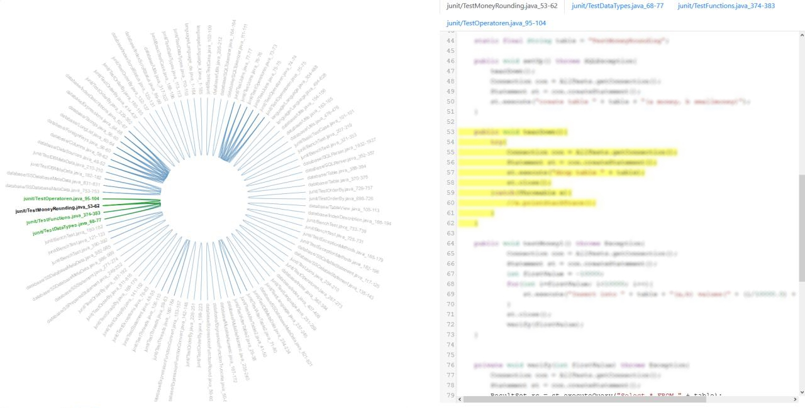

# University of Amsterdam
## Software Evolution Assignment 2: Clone detection

## Contributors:
 - Nicolae Marian Popa
 - Terry van Walen

## How to visualize output
* Put project into __.\clone_visualization\code\ {project_folder}__
* Execute Rascal project on code
  - __Import main;__
  - __main();__
* Move __.\series2\output\data.json__ to __.\clone_visualization\data.json__
* In __.\clone_visualization__ run: __node server.js__

## Problem statement
Code cloning is a phenomenon that is of both scientific and practical interest. In the lecture and the related papers, clone detection and management techniques were discussed, as well as the various arguments surrounding the problems that code cloning causes.

Build a clone detection tool which can detect the following types of clones:
 - Type 1: exact matching, ignoring whitespaces and comments
 - Type 2: syntactical copy with changes allowed in variable, type, function or identifiers
 - Type 3: copy with changed, added or deleted statements

## Approach
For this problem we chose to apply the algorithm described in the following paper:

Ira D. Baxter, Andrew Yahin, Leonardo Moura, Marcelo Sant'Anna, Lorraine Bier: *Clone Detection Using Abstract Syntax Trees (AST)*

The algorithm finds clones by comparing sub-trees of the project's AST. Although complexity of such an approach might go up to O(n^4), it is substantially reduced by hashing all the possible subtrees into buckets and then the comparison is done only between the subtrees in the buckets. A hash function which takes into account all elements in a tree will identify only exact matches. In order to account for near-miss clones, a particularly bad hash function can be chosen which does not take into account certain parts of the subtree, such as the leaves.

Similarity between two trees is calculated using the following formula:

Similarity = 2 x S / (2 x S + L + R) where
 - S = number of shared nodes
 - L = number of different nodes in sub-tree 1
 - R = number of different nodes in sub-tree 2

More particularly, we account for near-miss clones by normalizing the Abstract Syntax Tree and transforming the following properties to a single, common value:
 - names of: classes, interfaces, methods, constructors, variable, parameters, enums
 - return types
 - numbers, strings and character literals

Basic algorithm pseudocode:

```
Clones = empty_collection
For each subtree i:
    If mass(i) >= MassThreshold
    Then hash i to bucket
For each subtree i and j in the same bucket
  If CompareTree(i,j) > SimilarityThreshold
  Then {
    For each subtree s of i
      If IsMember(Clones, s)
      Then RemoveClonePair(Clones, s)
      For each subtree s of j
        If IsMember(Clones, s)
        Then RemoveClonePair(Clones, s)
      AddClonePair(Clones, i, j)
  }
```
where SimilarityThreshold is:
 - Type 1: 1.0
 - Type 2: 1.0
 - Type 3: 0.8

## Visualization
To do the visualization we chose to base our approach on:

*Voinea, L., & Telea, A. C. (2014, September). Visual clone analysis with SolidSDD. In Software Visualization (VISSOFT), 2014 Second IEEE Working Conference on (pp. 79-82). IEEE.*

In this work a structured Friendwheel is used to communicate the cloned code fragments as nodes and their relations as edges. When selecting parts a node or edge more details are shown like the respective files corresponding to the code fragments.

In our visualization we aim to show both a simplified friendwheel and the corresponding code fragments side by side in the same screen. This visualization technique is more versatile and usable than structure only views because you can immidiately see if a duplication warrants your time or not.

Examples of structure-only views:
* *R. Koschke, Identifying and Removing Software Clones, in Software Evolution, Springer, 2008*
  - Arc diagrams
  - Tree maps
  - Polymetric views
  - Dot plots

It is also more informative than detail only views that don't incorporate the relations between duplicated code fragments in the visualization. In these views the relations are unclear based on only the visualization and it is therefore difficult to see patterns between the code fragments.

Example:
* *R. Koschke, Identifying and Removing Software Clones, in Software Evolution, Springer, 2008*
  - File view

Therefore we aim to provide the most information in the least amount of space immediately available to most programmers: A 1080p computer monitor.



In the left view a simplified friend wheel is shown. It contains the code fragments and their relations among each other. When clicked on one of the nodes the right view shows the code fragment highlighted as part of the file it belongs to and the other corresponding fragments in views delimited by tabs.

###### What does the visualization offer?
Code fragments that are duplicated multiple times show as bundles. Code fragments are positioned next to each other to enhance readability. When hovering over the files they show the connections and become more visible by making the node bold and the nodes of the corresponding files green. The code fragments in the code view are highlighted and therefore easy to compare. Showing the rest of the file helps bring the code fragment in context.


## Testing
We test the following:
 - Similarity between different types of nodes
 - Transitive pairs removal
 - Expected type 1 clones on a small project
 - Expected type 2 clones on a small project
